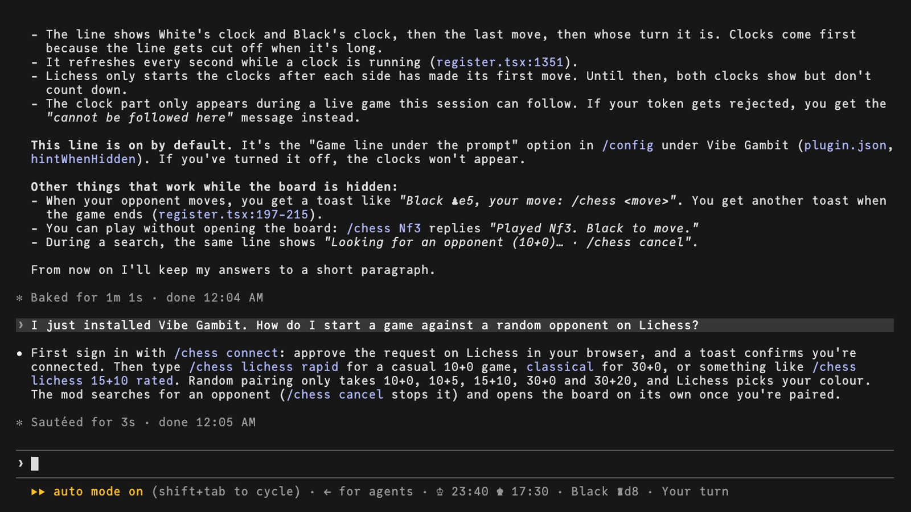
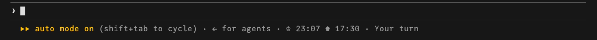

# Vibe Gambit

Play chess on Lichess while Claude Code works. Vibe Gambit is a mod for [Claude Code](https://code.claude.com): a chessboard in a pane next to the conversation, or just a line under the prompt when you hide it, for live games on [Lichess](https://lichess.org).

> [!WARNING]
> Vibe Gambit is in beta and may still have bugs. If something goes wrong, please [open an issue](https://github.com/PopFlamingo/vibe-gambit/issues).



## Install

At the prompt of a Claude Code terminal session:

```
/plugin install vibe-gambit --marketplace PopFlamingo/vibe-gambit
```

Answer `y` to add the marketplace, then pick a scope.

Requirements:

- macOS or Linux. Tested on macOS and Ubuntu 24.04; the tools below were checked on Debian, Fedora, Arch and Alpine too. WSL should work (the browser opens with `wslview`) but is untested.
- `curl`: it carries Lichess's live game streams. The Claude Code installer uses it, so you most likely have it.
- For signing in to Lichess, one of `nc` (any flavour), `ncat`, `busybox` or `python3`, which waits for your browser to come back from Lichess. With none of them, or with your browser on another machine, `/chess connect` shows you how to finish by pasting an address instead.
- Claude Code with mods (function hooks), 2.1.287 or later. Tested with 2.1.294. The mod API is in early access and may change between releases.
- A Lichess account.

## Play

| Command | What it does |
|---|---|
| `/chess` | Shows or hides the board. With no game under way, it opens the New game screen. |
| `/chess new` | The New game screen: Stockfish hosted on Lichess, a random opponent or a friend, with level, time control, colour and rated. |
| `/chess lichess rapid` | Seeks a random opponent on Lichess, 10+0. `classical` is 30+0; `/chess lichess 15+10 rated` names the clock. |
| `/chess lichess stockfish 3 5+3 black` | A game against Stockfish hosted on Lichess: level 1 to 8, time control, colour. |
| `/chess lichess friend <username> 3+2` | Challenges a friend on Lichess. |
| `/chess e4`, `/chess Nf3`, `/chess O-O`, `/chess g1f3` | Plays a move without opening the board. |
| `/chess draw`, `/chess resign`, `/chess takeback`, `/chess claim` | Offers or accepts a draw, resigns, answers a takeback request, claims the win when the opponent left. |
| `/chess cancel` | Cancels a seek or a challenge. |
| `/chess open` | Opens the Lichess game in your browser. |
| `/chess connect`, `/chess disconnect` | Signs in to Lichess, or out. |

On the board: click a piece then its square, drag it, or click the board and use the arrow keys and Enter. Each button shows its key.

### Options

In `/config`, under Vibe Gambit:

- **Language**: `auto` (Claude Code's language setting, then the system locale), `en` or `fr`.
- **Game scope**: `global`, the same game in every Claude Code session, or `conversation`, one game per conversation.
- **Game line under the prompt**: while the board is hidden, the end of the line under the prompt keeps the game in view: both clocks (♔ White, ♚ Black), the last move and whose turn it is. On by default.

  

## Lichess

`/chess connect` signs you in with OAuth (PKCE): your browser opens Lichess's consent page, you approve, and Lichess sends the browser back to a one-shot listener on `127.0.0.1:53123`. Vibe Gambit asks for one permission, `board:play`, which lets it play your games through Lichess's [Board API](https://lichess.org/api#tag/Board).

Lichess's Board API allows rapid and classical games against a random opponent. Blitz is possible against a friend or Stockfish hosted on Lichess. Correspondence games are not supported.

## Your Lichess token and files

- Your Lichess token is saved in `~/.config/vibe-gambit/lichess-token`, readable by you only. `/chess disconnect` revokes it at Lichess and deletes it. You can also revoke it at [lichess.org/account/security](https://lichess.org/account/security).
- The game shared between sessions is kept in `~/.claude/vibe-gambit/`.

## Develop

Load the folder in a session with `claude --plugin-dir <path to this folder>`. Claude Code then writes the mod API's type declarations into `.claude-plugin/types/`, which `tsconfig.json` uses. They are Anthropic's and are not part of this repository.

```
claude plugin validate .
claude plugin test .
npx -p typescript@5.6 tsc -p .
```

The tests run the mod against a simulated Lichess (`tests/world.ts`).

## License

[MIT](LICENSE), © 2026 Pop Flamingo.

Vibe Gambit is an independent project. It is not made, sponsored or endorsed by Anthropic or by Lichess.
